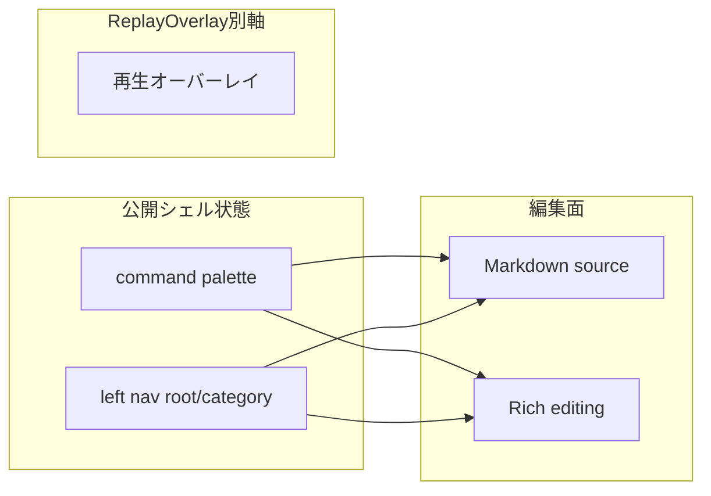

# Interaction Notes

## Session 129: Left Nav 対応確認メモ

- セクション / 構造の中身が入れ替わったように見える場合は、まず `#sidebar-nav-anchor` の label / `data-group` / `data-current-icon` と、active panel (`sections-gadgets-panel` / `structure-gadgets-panel`) を同時に確認する。
- `sections` の正しい見え方は「セクション」+ `list-tree` + `SectionsNavigator`。`structure` の正しい見え方は「構造」+ `file-text` + Documents / Outline / Tags/SmartFolders / StoryWiki / LinkGraph / SnapshotManager 系。
- Lucide の `<svg>` 化後に icon だけ stale になると、カテゴリ内容は正しくても「対応づけが壊れた」ように見える。session 129 では anchor icon を差し替え直す実装と E2E で固定済み。

報告UI・手動確認・質問形式に関する project-local メモ。

## 手動確認の出し方

- 手動確認項目は本文で提示する
- AskUserQuestion では `OK / NG番号` だけを聞く
- 手動確認依頼と次アクション選択を同じ質問に混ぜない
- 手動確認では具体的な UI チェックポイントを指定する (「UI を確認してください」は不可)

### 再確認を要求しない (session 108 追加)

- ショートカット操作、キーバインド、コマンドパレット経由など **user が過去に動作確認済みの機能は、新規変更がない限り再確認を依頼しない**。
- 確認依頼は user 実機でしか見えない UI の視覚的変化・新機能・不具合修正のみに絞る。
- docs に書く案内は **正確な現物表記** (例: Electron メニューの日本語ラベル「シェル(&V) > 左ナビ(&S)」) を優先。推測で英語表記を書かない。
- package/Electron 実機項目は `PASS / FAIL / HOLD` で記録し、`FAIL` は「再現手順 / 実際の結果 / 期待結果 / Webとの差分」を 1 セットで残す。

## 禁止パターン

- AskUserQuestion の `question` に Markdown テーブルを入れる
- 選択肢を commit / しない の yes/no で埋める
- 既知文脈を「詳細を教えてください」で再質問する
- Options に「別プロジェクトへ」「セッション終了」等の脱出選択肢を含めない

## ユーザーが好む形式

- 作業結果と今後のプランを表形式で分かりやすく提示
- 意思決定・手動確認地点を目安にプランを区切る
- 訂正は全体に適用する (部分修正の繰り返し禁止)

## 報告メモ

- BLOCK SUMMARY では先に原因分析を示す
- 見栄えのためにラベルを書き換えない (「手動」→「自動」のような実態と異なる書き換え禁止)
- **UI action label consistency**: 同じ surface に `保存` / `書き出し` / `読み込み` / `管理` / `適用` が並ぶ場合は、対象または役割をラベルに含める。例: `+ 文書` / `+ フォルダ`、`TXT書き出し`、`プロファイル保存`、`ロードアウト適用`。ダイアログ内など対象が明示される局所操作だけ `保存` / `削除` の短縮を許容する。

## 現在 deferred の手動確認

- Reader ボタンのスタイル一貫性 (session 37 で機能修正済み、見た目の確認のみ)
- Focus 左パネル間隔の体感確認 (ユーザーの実使用ウィンドウサイズで)

## UI 表面・コントロール台帳

ウィンドウ単位の表面一覧、`WritingTools` 登録との整合、同一機能の二重入口（削減時の判断材料）は [`UI_SURFACE_AND_CONTROLS.md`](UI_SURFACE_AND_CONTROLS.md) を参照する。本ファイルは **状態モデル（軸の定義）** の正本とし、DOM ごとの台帳はそちらに分離する。

---

## Session 121: 統合シェル UI（現行正本）

- この節が **現行のユーザー向け UI 正本**。下の `normal` / `focus` 中心の説明は internal compatibility の履歴として残っているが、新規判断はこの節を優先する。
- 公開 UI 状態は `display mode` ではなく、**left nav の階層状態 (`root` / `category`) / command palette / Reader・Replay surface の開閉** で表現する。
- **retired top chrome**: visible surface としては廃止。`F2` / Electron menu / 旧 toolbar 互換経路は command palette を開く。上端 hover reveal、visible handle、上部 drag lane は復活させない。
- **left nav**: root は通常時に完全非表示。不可視の left edge rail に触れたときだけ root rail を fade-in し、見た目幅を出たら即 dismiss する。root では全カテゴリを見せ、直前に開いていたカテゴリには **last active cue** を残す。category では active category を左上固定し、他カテゴリは fade-out 後に `pointer-events: none` / inert 扱いにする。category 中のみ左列全体を root 戻り hit target とし、root icon rail 表示中は back rail を出さない。展開中は内部 toolbar/header/accordion content を最終 category 幅で保持し、外枠だけを clipped reveal する。カテゴリ切替は一度 root に戻ってから選び直す。
- **sidebar / gadget foundation**: left nav 上段は静かな shell とし、dock / chrome 系の移動・常設操作は clutter として見せない。Documents の `+ 文書` / `+ フォルダ` / `保存` / `入出力` / `管理`、gadget controls、sidebar fields、menus、scrollbars は共通 shell token に従う。gadget header は開閉操作、専用 drag handle は並び替え操作として分離し、`aria-expanded` / `aria-hidden` を同期する。
- **Story Wiki / Link Graph**: Story Wiki は通常 gadget と同じ collapse 契約に従い、閉じた時に body の余白や hit area を残さない。Link Graph は sidebar 内で横スクロール前提にせず、graph node と scrollbar を shell の小型カード内に収める。
- **first-open feel**: category 選択時は left nav shell を先に安定表示し、重い gadget render は遅延初期化する。初回展開中に graph / Wiki / documents が狭幅で同期描画されて潰れる状態を避ける。
- **surface wording**: Reader / Replay は「モード切替」ではなく shell 内 surface。command palette の visible command は `Reader を開く / 閉じる`, `左ナビのルートへ戻る` など実 surface 操作を基準にし、`ui-mode-*` / `toggle-fullscreen` / top chrome 表示 command は visible list に残さない。
- **shortcut semantics**: `F2` は command palette を表示してフォーカスする。`toolbar.toggle` 互換経路も command palette へ誘導する。
- packaged/Electron では visible menu も `シェル` ベースで表現し、F2 は command palette に揃える。frameless window の通常移動導線として左上に小さな Electron-only window grip を置き、最小化・最大化/復元・閉じるは右上の Electron-only window controls island で局所 hover / focus 時だけ fade-in する。left-edge hover は root rail の一時 fade-in に限定する。

---

## Zen Writer UI 状態モデル（ユーザー向け・正本）

執筆 UI の混乱（リッチ編集表示、Markdown source、読者プレビュー、プレビュー周り）を防ぐため、現行の公開 UI は **シェル状態** と **Editor surface** で説明する。`normal` / `focus` は互換 API の値であり、新規仕様・手動確認・ユーザー向け説明の主語にしない。

### 軸 1: 公開シェル状態

| 状態 | 主な用途 | 操作入口 |
|------|----------|----------|
| command palette | 横断操作入口。F2 / Electron menu / 旧 toolbar 互換経路から開く | `F2` / Electron menu / command palette shortcut |
| window controls island | Electron frameless window の最小化・最大化/復元・閉じる。右上局所 hover / focus 時だけ表示 | 右上 hover / focus |
| window grip | Electron frameless window の通常時移動。Editor本文やsidebarは drag region にしない。初期透明で hover 時だけ icon 表示 | 左上 grip |
| left nav root | 通常時は完全非表示。left edge hover でカテゴリ一覧と last active cue を一時表示する | 左端 hover |
| left nav category | active category の label / icon / panel / gadget loadout を表示し、左列 back rail で root へ戻れる | root からカテゴリ選択 |
| replay surface | **閲覧専用**の読者視点確認。編集面とは同時操作しない | Reader / Replay command |

**互換既定**: 新規・未設定の `settings.ui.uiMode` は統合シェルの **`normal`** に正規化する。過去の `focus` / `reader` / `blank` 保存値も `normal` に吸収し、公開 UI では left nav hierarchy / command palette / Reader surface を状態の起点にする。`settings.sidebarOpen` の既定は **`false`**。

**用語の区別（混同しないこと）**

- **再生オーバーレイ**: アプリ内で原稿を「読者側の見え方」で確認する **一時オーバーレイ**であり、UI モードそのものではない。
- **スクリーンリーダー**などの支援技術: OS や AT が画面を読み上げる仕組み。再生オーバーレイとは別物であり、両者を同一視しない。

内部互換 API: `ZenWriterApp.setUIMode('normal'|'focus')`。visible command は `ui-mode-*` ではなく、command palette / left nav / Reader surface の操作名に寄せる。

### 軸 2: Editor surface（ミニマル／通常表示 いずれでも同じ）

Editor は唯一の執筆面。`Rich editing` と `Markdown source` は同じ原稿データの **表示・編集表現** であり、UI モードを増やすものではない。

| 表示 | 日本語 | 主な用途 |
|------|--------|----------|
| Rich editing | リッチ編集表示 | 既定の執筆表示。見出し・段落・装飾を視覚的に編集する（UI モードは変わらない） |
| Markdown source | Markdown source | raw Markdown を直接確認・修正する escape hatch（**開発者モード時のみ** UI から切替可能） |

**開発者モード**（`ZenWriterDeveloperMode.isEnabled()`）: `localStorage` キー `zenwriter-developer-mode` が `'true'`、またはホストが `localhost` / `127.0.0.1` のとき真。真のときのみ Markdown source への切替（サイドバー操作帯・リッチ編集オーバーフロー・一部コマンド）が有効。一般配布では `file://` 等では既定オフ。

補足:

- **MD プレビュー**（shell UI／サイドバー内「MD プレビュー」）は、編集画面の横またはパネルに **レンダリング結果を並べて表示**するもの（再生オーバーレイではない）。
- **再生オーバーレイ / Reader surface**は `ZWReaderPreview.enter()/exit()/toggle()` で開閉する編集不可の読者確認面。中央揃え・左寄せなど Editor の表示調整とは別に、出力パイプライン・演出・縦書き・export 前の見え方確認を担う。編集は「編集に戻る」で執筆面へ復帰する。

### 関係図（概念）

内部互換値は **`normal` / `focus` のみ**（`setUIMode`）。**再生オーバーレイ**は別軸（`data-reader-overlay-open`・閲覧専用）。第4の UI モードとしての「Reader」は廃止済み（session 68）。

**user 視点 (session 121 以降、2026-04-28更新)**: 画面操作は **command palette / left nav root-category / Reader surface / Electron window controls island** で説明する。`F2` は command palette を表示してフォーカスする。旧 `#view-menu` 集約、F2 の表示レイアウト循環、`通常モード` / `フォーカスモード` command、visible top chrome surface を新規導線として復活させない。

`Replay` は通常の編集状態から開ける（入場直前の `data-ui-mode` は内部互換値として維持）。オーバーレイと編集面は同時に操作対象にはならない（閉じてから執筆へ復帰）。

ヘルプ・ツールチップ・コマンドパレットの文言は上表に揃える（英語 UI では `Replay overlay` / `Rich edit` / `Markdown preview` など対応語を固定）。

### WP-004 Phase 2: 既定・復帰ポリシー（実装準拠）

- **Reader からの復帰**: 入場直前の `data-ui-mode`（`normal` または `focus`）へ戻す。入場時に既に `reader` だった場合は `normal` に正規化。退場時に復帰先が `reader` になる場合は `normal` にフォールバック。
- **復帰直後のフォーカス**: メインの編集面へ移す（リッチ編集表示中は `wysiwyg-editor`、否则は `#editor`）。
- **編集面の既定起動**: キー未設定または `'true'` のときは起動後にリッチ編集へ切り替え。**開発者モード無効**のときは `zenwriter-wysiwyg-mode` が `'false'` でもリッチ編集へ寄せ、キーを `'true'` に戻す（一般ユーザーはソース編集 UI に到達しない）。

### WP-004 Phase 3（進行中）

- **差分の列挙と手動シナリオ**: [docs/WP004_PHASE3_PARITY_AUDIT.md](WP004_PHASE3_PARITY_AUDIT.md)。テキストボックス `target`（preview/reader/wysiwyg）の現状仕様: [docs/specs/spec-textbox-render-targets.md](specs/spec-textbox-render-targets.md)
- **markdown-it 前段の共有**: [js/zw-markdown-it-body.js](js/zw-markdown-it-body.js) の `ZWMdItBody.renderToHtmlBeforePipeline(markdown, { editorManager? })` が、:::zw-* DSL 退避・markdown-it 変換・DSL 復元までを担当する。MD プレビューは `editorManager` を渡して従来どおり `_markdownRenderer` を共用する。読者プレビューは `ZenWriterEditor.richTextEditor.markdownRenderer`（なければ同一設定のフォールバック）を使い、**`RichTextEditor.markdownToHtml` は経由しない**（リッチ編集キャンバス用の経路と分離し、パイプライン後処理の二重適用を防ぐ）。
- **インライン記法**（wikilink / 傍点 / ルビ）: [js/zw-inline-html-postmarkdown.js](js/zw-inline-html-postmarkdown.js)
- **Reader の wikilink クリック**: Story Wiki に項目があるときはタイトル＋抜粋のポップオーバー。**未登録**（`a.wikilink.is-broken`）のときも同様にポップオーバーでタイトルと「項目はまだありません」を示す（[js/reader-preview.js](js/reader-preview.js) `showReaderWikiPopover`）。外クリックで閉じる。
- **MD→装飾→章リンクの共通順序**: [js/zw-postmarkdown-html-pipeline.js](js/zw-postmarkdown-html-pipeline.js) の `ZWPostMarkdownHtmlPipeline.apply(html, { surface: 'preview'|'reader' })`。`reader` では `convertChapterLinks` の後に `convertForExport` を実行し、`chapter://` をページ内 `#` アンカーへ揃える（以前 Reader だけ `convertForExport` のみで `.chapter-link` 前提を満たせないケースがあった）。
- **章末ナビ（Reader）**: `settings.chapterNav.enabled` が真で複数 visible 章があるとき、[js/chapter-nav.js](js/chapter-nav.js) の `injectNavBars` が読者本文（`.reader-preview__content`）にも `.chapter-nav-bar` を注入する（[js/reader-preview.js](js/reader-preview.js) から呼び出し）。結合 smoke: [e2e/reader-chapter-nav.spec.js](../e2e/reader-chapter-nav.spec.js)。
- **テキストボックス DSL 投影**: パイプラインは `TextboxRichTextBridge.projectRenderedHtml(html, { settings, target: 'preview'|'reader' })` を先に実行する。`target` は `TextboxEffectRenderer` → `TextExpressionPresetResolver.resolveTextbox` に渡り、将来の面別調整用（現状は主に `reduceMotion` 等と併用可能）。**ブロック段落の `text-align`（左・中・右）**は **リッチテキスト・プログラム**（P2）で扱う。`data-zw-align` はリッチ編集・paste・Turndown で付与され、**MD プレビューは `#markdown-preview-panel` 内**、**読者本文は `.reader-preview__content` 内**で `css/style.css` が `text-align` に投影する（`ZWPostMarkdownHtmlPipeline` は揃え用に改変しない）。

**手動確認推奨**: `chapter://` や章末ナビを含む原稿で、MD プレビューと読者プレビューの見え方・リンク挙動を並べて確認する。

### リッチテキスト: 改行と装飾（将来実装の前提）

| 項目 | 内容 |
|------|------|
| **設定キー** | `effectBreakAtNewline`（`settings.editor`） |
| **既定** | `true`（改行で装飾・効果を切断） |
| **追加キー（Enter 接続済み）** | `effectPersistDecorAcrossNewline`（既定 `false`。`true` で Enter 後も decor-* 内にカーソルを残す。詳細は `spec-rich-text-newline-effect.md`） |
| **ショートカット** | `effectPersistDecorAcrossNewline`: **Ctrl+Shift+Alt+D**（macOS: **⌘+Shift+Option+D**）。リッチ編集フォーカス時のみ有効。`effectBreakAtNewline` 用ショートカットは未割当 |
| **設定 UI** | サイドバー **詳細設定** の **UI Settings** 内: `effectBreakAtNewline` はチェック **改行で装飾・効果を切る**（id: `effect-break-at-newline`）。`effectPersistDecorAcrossNewline` は **改行後も装飾スパン内にカーソルを残す**（id: `effect-persist-decor-across-newline`） |

正本の論点: [`docs/specs/spec-rich-text-newline-effect.md`](specs/spec-rich-text-newline-effect.md)。
