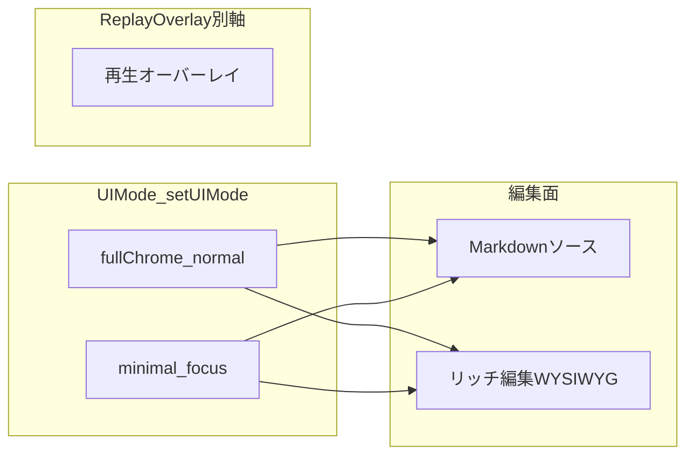

# Interaction Notes

報告UI・手動確認・質問形式に関する project-local メモ。

## 手動確認の出し方

- 手動確認項目は本文で提示する
- AskUserQuestion では `OK / NG番号` だけを聞く
- 手動確認依頼と次アクション選択を同じ質問に混ぜない
- 手動確認では具体的な UI チェックポイントを指定する (「UI を確認してください」は不可)

### 再確認を要求しない (session 108 追加)

- ショートカット操作、キーバインド、コマンドパレット経由など **user が過去に動作確認済みの機能は、新規変更がない限り再確認を依頼しない**。
- 確認依頼は user 実機でしか見えない UI の視覚的変化・新機能・不具合修正のみに絞る。
- docs に書く案内は **正確な現物表記** (例: Electron メニューの日本語ラベル「表示(&V) > 全画面表示(&L)」) を優先。推測で英語表記を書かない。
- package/Electron 実機項目は `PASS / FAIL / HOLD` で記録し、`FAIL` は「再現手順 / 実際の結果 / 期待結果 / Webとの差分」を 1 セットで残す。

## 禁止パターン

- AskUserQuestion の `question` に Markdown テーブルを入れる
- 選択肢を commit / しない の yes/no で埋める
- 既知文脈を「詳細を教えてください」で再質問する
- Options に「別プロジェクトへ」「セッション終了」等の脱出選択肢を含めない

## ユーザーが好む形式

- 作業結果と今後のプランを表形式で分かりやすく提示
- 意思決定・手動確認地点を目安にプランを区切る
- 訂正は全体に適用する (部分修正の繰り返し禁止)

## 報告メモ

- BLOCK SUMMARY では先に原因分析を示す
- 見栄えのためにラベルを書き換えない (「手動」→「自動」のような実態と異なる書き換え禁止)

## 現在 deferred の手動確認

- Reader ボタンのスタイル一貫性 (session 37 で機能修正済み、見た目の確認のみ)
- Focus 左パネル間隔の体感確認 (ユーザーの実使用ウィンドウサイズで)

## UI 表面・コントロール台帳

ウィンドウ単位の表面一覧、`WritingTools` 登録との整合、同一機能の二重入口（削減時の判断材料）は [`UI_SURFACE_AND_CONTROLS.md`](UI_SURFACE_AND_CONTROLS.md) を参照する。本ファイルは **状態モデル（軸の定義）** の正本とし、DOM ごとの台帳はそちらに分離する。

---

## Zen Writer UI 状態モデル（ユーザー向け・正本）

執筆 UI の混乱（WYSIWYG と読者プレビュー、プレビュー周り）を防ぐため、**独立した 2 軸**で説明する。

### 軸 1: UI モード（アプリ全体）

| モード | 日本語 | 主な用途 |
|--------|--------|----------|
| `normal` | 通常表示 | **上部の横帯メインツールバーは廃止**。主要操作はサイドバー先頭の操作帯＋メインハブ。サイドバー開閉は左端エッジホバー・`Alt+1`・コマンドパレット・Electron メニュー等（可視 FAB は廃止）。開閉状態は `settings.sidebarOpen` で復元 |
| `focus` | ミニマル（既定） | 執筆集中。上端ホバー（メインハブ）・左端ホバー（サイドバー／章パネル）・ショートカット等で操作へ到達（左下の常時 FAB によるサイドバー導線は廃止） |
| `replay-overlay` | 再生オーバーレイ | **閲覧専用**の読者視点確認。`data-reader-overlay-open` で開閉（UI モードとは独立） |

**既定**: 新規・未設定の `settings.ui.uiMode` は **`focus`（ミニマル）**。`settings.sidebarOpen` の既定は **`false`**（左サイドバーは閉じた状態で起動。機能はサイドバー内に維持され、開けば従来どおり全カテゴリに到達可能）。

**用語の区別（混同しないこと）**

- **再生オーバーレイ**: アプリ内で原稿を「読者側の見え方」で確認する **一時オーバーレイ**であり、UI モードそのものではない。
- **スクリーンリーダー**などの支援技術: OS や AT が画面を読み上げる仕組み。**Reader モードとは別物**である。本プロダクトは Reader モードにボイスを乗せる設計にはしておらず、両者を同一視しない。

切替 API: `ZenWriterApp.setUIMode('normal'|'focus')`（コマンドパレット・モードボタンもこれに集約）。

### 軸 2: 編集面（ミニマル／通常表示 いずれでも同じ）

| 表示 | 日本語 | 主な用途 |
|------|--------|----------|
| Markdown ソース | テキストエリア | `# 見出し` など記法で入力（**開発者モード時のみ** UI から切替可能） |
| WYSIWYG | リッチ編集 | 既定の執筆面。装飾を視覚的に編集（UI モードは変わらない） |

**開発者モード**（`ZenWriterDeveloperMode.isEnabled()`）: `localStorage` キー `zenwriter-developer-mode` が `'true'`、またはホストが `localhost` / `127.0.0.1` のとき真。真のときのみ Markdown ソースへの切替（サイドバー操作帯・WYSIWYG オーバーフロー・一部コマンド）が有効。一般配布では `file://` 等では既定オフ。

補足:

- **MD プレビュー**（サイドバー先頭の操作帯／サイドバー内「MD プレビュー」）は、編集画面の横またはパネルに **レンダリング結果を並べて表示**するもの（Reader モードではない）。
- **再生オーバーレイ**は `ZWReaderPreview.enter()/exit()/toggle()` で開閉。編集は「編集に戻る」で執筆面へ復帰する。

### 関係図（概念）

UI モードは **`normal` / `focus` のみ**（`setUIMode`）。**再生オーバーレイ**は別軸（`data-reader-overlay-open`・閲覧専用）。第4の UI モードとしての「Reader」は廃止済み（session 68）。

**user 視点 (session 107)**: 画面全体を変える操作は **サイドバー先頭の「表示」メニュー (`#view-menu`) 1 点に集約** されている。表示レイアウト (通常表示 / ミニマル) + 再生オーバーレイ + 編集面 (リッチ編集 / Markdown、dev-only) を同じドロップダウン内で選択。F2 ショートカットで表示レイアウトのみ循環。撤去済み: `#fullscreen` / 旧「フル/最小」個別ボタン / Focus 章パネルの「フル」復帰ボタン / 最小モード下部の「詳細」「通常表示」。

`Replay` は `Normal` / `Focus` のどちらでも開ける（入場直前の `data-ui-mode` は維持）。オーバーレイと編集面は同時に操作対象にはならない（閉じてから執筆へ復帰）。

ヘルプ・ツールチップ・コマンドパレットの文言は上表に揃える（英語 UI では `Replay overlay` / `Rich edit` / `Markdown preview` など対応語を固定）。

### WP-004 Phase 2: 既定・復帰ポリシー（実装準拠）

- **Reader からの復帰**: 入場直前の `data-ui-mode`（`normal` または `focus`）へ戻す。入場時に既に `reader` だった場合は `normal` に正規化。退場時に復帰先が `reader` になる場合は `normal` にフォールバック。
- **復帰直後のフォーカス**: メインの編集面へ移す（リッチ編集表示中は `wysiwyg-editor`、否则は `#editor`）。
- **編集面の既定起動**: キー未設定または `'true'` のときは起動後にリッチ編集へ切り替え。**開発者モード無効**のときは `zenwriter-wysiwyg-mode` が `'false'` でもリッチ編集へ寄せ、キーを `'true'` に戻す（一般ユーザーはソース編集 UI に到達しない）。

### WP-004 Phase 3（進行中）

- **差分の列挙と手動シナリオ**: [docs/WP004_PHASE3_PARITY_AUDIT.md](WP004_PHASE3_PARITY_AUDIT.md)。テキストボックス `target`（preview/reader/wysiwyg）の現状仕様: [docs/specs/spec-textbox-render-targets.md](specs/spec-textbox-render-targets.md)
- **markdown-it 前段の共有**: [js/zw-markdown-it-body.js](js/zw-markdown-it-body.js) の `ZWMdItBody.renderToHtmlBeforePipeline(markdown, { editorManager? })` が、:::zw-* DSL 退避・markdown-it 変換・DSL 復元までを担当する。MD プレビューは `editorManager` を渡して従来どおり `_markdownRenderer` を共用する。読者プレビューは `ZenWriterEditor.richTextEditor.markdownRenderer`（なければ同一設定のフォールバック）を使い、**`RichTextEditor.markdownToHtml` は経由しない**（WYSIWYG キャンバス用の経路と分離し、パイプライン後処理の二重適用を防ぐ）。
- **インライン記法**（wikilink / 傍点 / ルビ）: [js/zw-inline-html-postmarkdown.js](js/zw-inline-html-postmarkdown.js)
- **Reader の wikilink クリック**: Story Wiki に項目があるときはタイトル＋抜粋のポップオーバー。**未登録**（`a.wikilink.is-broken`）のときも同様にポップオーバーでタイトルと「項目はまだありません」を示す（[js/reader-preview.js](js/reader-preview.js) `showReaderWikiPopover`）。外クリックで閉じる。
- **MD→装飾→章リンクの共通順序**: [js/zw-postmarkdown-html-pipeline.js](js/zw-postmarkdown-html-pipeline.js) の `ZWPostMarkdownHtmlPipeline.apply(html, { surface: 'preview'|'reader' })`。`reader` では `convertChapterLinks` の後に `convertForExport` を実行し、`chapter://` をページ内 `#` アンカーへ揃える（以前 Reader だけ `convertForExport` のみで `.chapter-link` 前提を満たせないケースがあった）。
- **章末ナビ（Reader）**: `settings.chapterNav.enabled` が真で複数 visible 章があるとき、[js/chapter-nav.js](js/chapter-nav.js) の `injectNavBars` が読者本文（`.reader-preview__content`）にも `.chapter-nav-bar` を注入する（[js/reader-preview.js](js/reader-preview.js) から呼び出し）。結合 smoke: [e2e/reader-chapter-nav.spec.js](../e2e/reader-chapter-nav.spec.js)。
- **テキストボックス DSL 投影**: パイプラインは `TextboxRichTextBridge.projectRenderedHtml(html, { settings, target: 'preview'|'reader' })` を先に実行する。`target` は `TextboxEffectRenderer` → `TextExpressionPresetResolver.resolveTextbox` に渡り、将来の面別調整用（現状は主に `reduceMotion` 等と併用可能）。**ブロック段落の `text-align`（左・中・右）**は **リッチテキスト・プログラム**（P2）で扱う。`data-zw-align` は WYSIWYG・paste・Turndown で付与され、**MD プレビューは `#markdown-preview-panel` 内**、**読者本文は `.reader-preview__content` 内**で `css/style.css` が `text-align` に投影する（`ZWPostMarkdownHtmlPipeline` は揃え用に改変しない）。

**手動確認推奨**: `chapter://` や章末ナビを含む原稿で、MD プレビューと読者プレビューの見え方・リンク挙動を並べて確認する。

### リッチテキスト: 改行と装飾（将来実装の前提）

| 項目 | 内容 |
|------|------|
| **設定キー** | `effectBreakAtNewline`（`settings.editor`） |
| **既定** | `true`（改行で装飾・効果を切断） |
| **追加キー（Enter 接続済み）** | `effectPersistDecorAcrossNewline`（既定 `false`。`true` で Enter 後も decor-* 内にカーソルを残す。詳細は `spec-rich-text-newline-effect.md`） |
| **ショートカット** | `effectPersistDecorAcrossNewline`: **Ctrl+Shift+Alt+D**（macOS: **⌘+Shift+Option+D**）。WYSIWYG フォーカス時のみ有効。`effectBreakAtNewline` 用ショートカットは未割当 |
| **設定 UI** | サイドバー **詳細設定** の **UI Settings** 内: `effectBreakAtNewline` はチェック **改行で装飾・効果を切る**（id: `effect-break-at-newline`）。`effectPersistDecorAcrossNewline` は **改行後も装飾スパン内にカーソルを残す**（id: `effect-persist-decor-across-newline`） |

正本の論点: [`docs/specs/spec-rich-text-newline-effect.md`](specs/spec-rich-text-newline-effect.md)。
