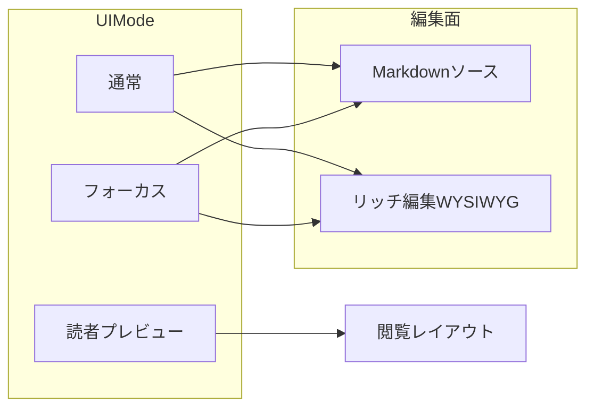

# Interaction Notes

報告UI・手動確認・質問形式に関する project-local メモ。

## 手動確認の出し方

- 手動確認項目は本文で提示する
- AskUserQuestion では `OK / NG番号` だけを聞く
- 手動確認依頼と次アクション選択を同じ質問に混ぜない
- 手動確認では具体的な UI チェックポイントを指定する (「UI を確認してください」は不可)

## 禁止パターン

- AskUserQuestion の `question` に Markdown テーブルを入れる
- 選択肢を commit / しない の yes/no で埋める
- 既知文脈を「詳細を教えてください」で再質問する
- Options に「別プロジェクトへ」「セッション終了」等の脱出選択肢を含めない

## ユーザーが好む形式

- 作業結果と今後のプランを表形式で分かりやすく提示
- 意思決定・手動確認地点を目安にプランを区切る
- 訂正は全体に適用する (部分修正の繰り返し禁止)

## 報告メモ

- BLOCK SUMMARY では先に原因分析を示す
- 見栄えのためにラベルを書き換えない (「手動」→「自動」のような実態と異なる書き換え禁止)

## 現在 deferred の手動確認

- Reader ボタンのスタイル一貫性 (session 37 で機能修正済み、見た目の確認のみ)
- Focus 左パネル間隔の体感確認 (ユーザーの実使用ウィンドウサイズで)

---

## Zen Writer UI 状態モデル（ユーザー向け・正本）

執筆 UI の混乱（WYSIWYG と読者プレビュー、プレビュー周り）を防ぐため、**独立した 2 軸**で説明する。

### 軸 1: UI モード（アプリ全体）

| モード | 日本語 | 主な用途 |
|--------|--------|----------|
| `normal` | 通常 | サイドバー・ツールバーで全機能にアクセス |
| `focus` | フォーカス | 執筆集中。エッジホバーでツールバー／章パネル |
| `reader` | 読者プレビュー | **閲覧専用**の読了レイアウト。メインエディタは隠れる |

**用語の区別（混同しないこと）**

- **読者プレビュー / Reader モード**（上表の `reader`）: アプリ内で原稿を「読者側の見え方」で確認する **UI レイアウト**の名前である。
- **スクリーンリーダー**などの支援技術: OS や AT が画面を読み上げる仕組み。**Reader モードとは別物**である。本プロダクトは Reader モードにボイスを乗せる設計にはしておらず、両者を同一視しない。

切替 API: `ZenWriterApp.setUIMode('normal'|'focus'|'reader')`（コマンドパレット・モードボタンもこれに集約）。

### 軸 2: 編集面（通常／フォーカス時のみ）

| 表示 | 日本語 | 主な用途 |
|------|--------|----------|
| Markdown ソース | テキストエリア | `# 見出し` など記法で入力 |
| WYSIWYG | リッチ編集 | 装飾を視覚的に編集（**編集可能**。UI モードは変わらない） |

補足:

- **MD プレビュー**（ツールバー／サイドバー「MD プレビュー」）は、編集画面の横またはパネルに **レンダリング結果を並べて表示**するもの（Reader モードではない）。
- **読者プレビュー**は UI モード `reader` のみ。編集は「編集に戻る」で `normal` 等へ戻す。

### 関係図（概念）

ヘルプ・ツールチップ・コマンドパレットの文言は上表に揃える（英語 UI では `Reader preview` / `Rich edit` / `Markdown preview` など対応語を固定）。

### WP-004 Phase 2: 既定・復帰ポリシー（実装準拠）

- **Reader からの復帰**: 入場直前の `data-ui-mode`（`normal` または `focus`）へ戻す。入場時に既に `reader` だった場合は `normal` に正規化。退場時に復帰先が `reader` になる場合は `normal` にフォールバック。
- **復帰直後のフォーカス**: メインの編集面へ移す（リッチ編集表示中は `wysiwyg-editor`、否则は `#editor`）。
- **編集面の既定起動**: `localStorage` キー `zenwriter-wysiwyg-mode` が `'false'` のときのみ Markdown ソースのまま起動。キー未設定または `'true'` のときは起動後にリッチ編集へ切り替え（従来どおり）。

### WP-004 Phase 3（進行中）

- **markdown-it 前段の共有**: [js/zw-markdown-it-body.js](js/zw-markdown-it-body.js) の `ZWMdItBody.renderToHtmlBeforePipeline(markdown, { editorManager? })` が、:::zw-* DSL 退避・markdown-it 変換・DSL 復元までを担当する。MD プレビューは `editorManager` を渡して従来どおり `_markdownRenderer` を共用する。読者プレビューは `ZenWriterEditor.richTextEditor.markdownRenderer`（なければ同一設定のフォールバック）を使い、**`RichTextEditor.markdownToHtml` は経由しない**（WYSIWYG キャンバス用の経路と分離し、パイプライン後処理の二重適用を防ぐ）。
- **インライン記法**（wikilink / 傍点 / ルビ）: [js/zw-inline-html-postmarkdown.js](js/zw-inline-html-postmarkdown.js)
- **MD→装飾→章リンクの共通順序**: [js/zw-postmarkdown-html-pipeline.js](js/zw-postmarkdown-html-pipeline.js) の `ZWPostMarkdownHtmlPipeline.apply(html, { surface: 'preview'|'reader' })`。`reader` では `convertChapterLinks` の後に `convertForExport` を実行し、`chapter://` をページ内 `#` アンカーへ揃える（以前 Reader だけ `convertForExport` のみで `.chapter-link` 前提を満たせないケースがあった）。
- **テキストボックス DSL 投影**: パイプラインは `TextboxRichTextBridge.projectRenderedHtml(html, { settings, target: 'preview'|'reader' })` を先に実行する。`target` は `TextboxEffectRenderer` → `TextExpressionPresetResolver.resolveTextbox` に渡り、将来の面別調整用（現状は主に `reduceMotion` 等と併用可能）。**ブロック段落の `text-align`（左・中・右）**は WP-004 ではなく **リッチテキスト・プログラム**（`docs/specs/spec-richtext-enhancement.md` / `spec-rich-text-paragraph-alignment.md`）で扱う。

**手動確認推奨**: `chapter://` や章末ナビを含む原稿で、MD プレビューと読者プレビューの見え方・リンク挙動を並べて確認する。
