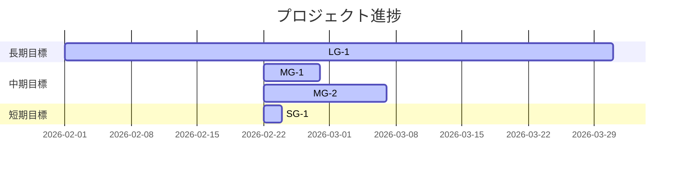

# Milestone Plan

## 基本情報

- **最終更新**: 2026-02-22T06:03:52+09:00
- **更新者**: AI Agent

---

## 長期目標（Someday / 月次〜四半期）

### LG-1: WritingPage の拡張性と運用品質の両立

- **ゴール**: UI拡張を継続しつつ、アーキテクチャの保守性・テスト容易性を維持する。
- **期限目安**: 2026-03
- **状態**: 進行中
- **進捗**: 85%
- **関連マイルストーン**: MG-1, MG-2

---

## 中期目標（Later / 1〜2週間）

### MG-1: リファクタリングと型安全化の完了

- **ゴール**: editor/app の分割とガジェットAPIの型安全化を完了し、変更容易性を改善する。
- **期限目安**: 2026-02-28
- **状態**: 進行中
- **進捗**: 60%
- **含まれるタスク**: TASK_046, TASK_047, TASK_052
- **完了基準**:
  - [ ] `js/editor.js` の責務分離完了
  - [ ] `js/app.js` の責務分離完了
  - [ ] ガジェットAPIの型定義と静的検証導入
  - [ ] テスト全通過・ビルド成功

### MG-2: UI強化タスク群の収束

- **ゴール**: フローティングパネル・タブ配置・ルビテキストの主要要件を完了する。
- **期限目安**: 2026-03-07
- **状態**: 進行中
- **進捗**: 45%
- **含まれるタスク**: TASK_045, TASK_048, TASK_054, TASK_055
- **完了基準**:
  - [ ] UI回帰のない状態で主要機能が利用可能
  - [ ] 主要操作のE2Eまたはスモーク検証が再現可能
  - [ ] テスト全通過・ビルド成功

---

## 短期目標（Next / 今日〜数日）

### SG-1: Batch 1 の実装着手順序を確定

- **ゴール**: OPEN/READY タスクを優先度・依存関係で並べ、Worker起動順を確定する。
- **対象タスク**: TASK_046, TASK_047, TASK_052, TASK_055
- **完了基準**:
  - [ ] P2.5 の3案比較と推奨案決定
  - [ ] P3 で Worker 割り当て戦略を確定

---

## 現在地マップ

---

## 振り返りログ（KPT）

### 2026-02-22: P2 初期化（タスク棚卸し後）

**Keep（続けること）**:

- OPENタスクをHANDOVERと整合して管理できている。

**Problem（課題）**:

- MISSION_LOG の鮮度低下と phase/status 表記の古さ。
- タスク命名が重複しているファイル（同番号別件）があり、追跡コストが高い。

**Try（次に試すこと）**:

- P3で Batch を再定義し、命名衝突タスクを明示的に分離して扱う。
- P6 で MISSION_LOG の先頭メタ情報を更新する運用を固定化する。

**優先度変更**:

- TASK_055（READY）を OPEN 群より先行候補に引き上げて検討する。

---

## 履歴

- 2026-02-22 06:03: MILESTONE_PLAN.md を初期化
