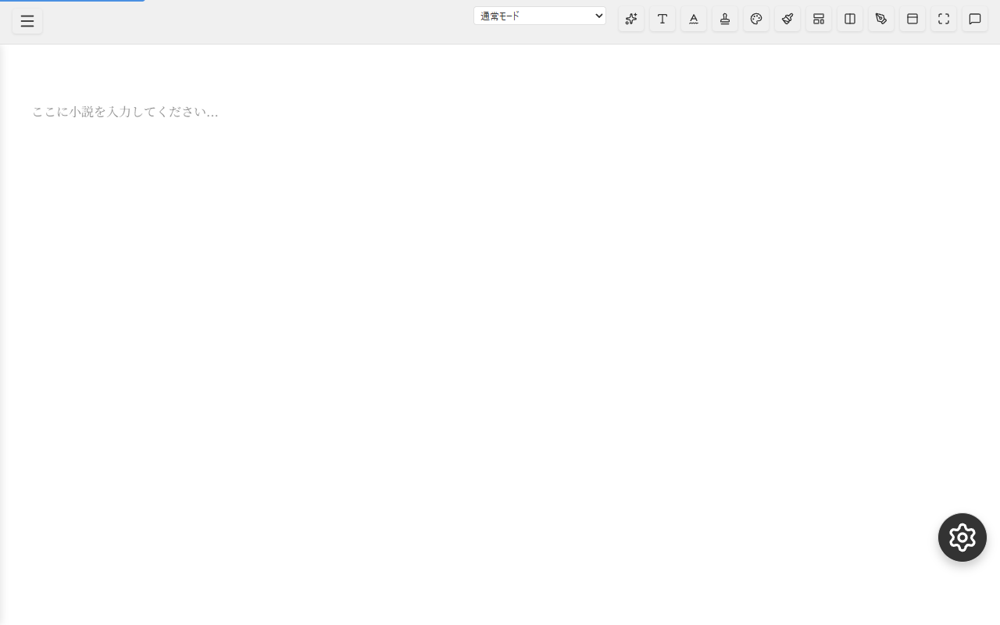
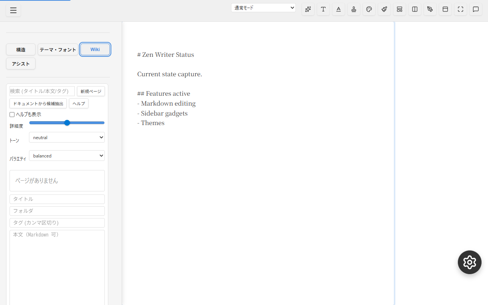
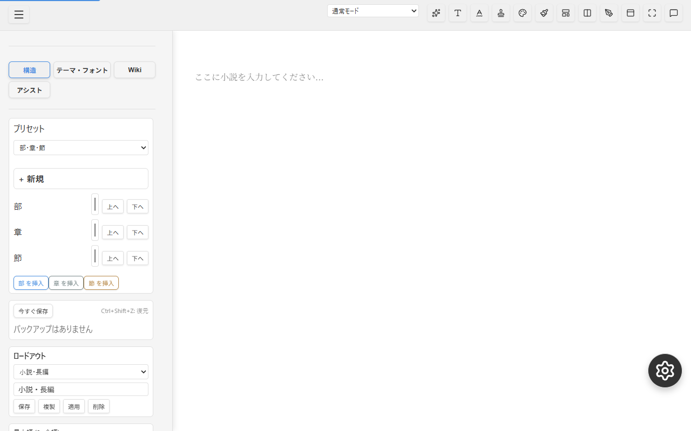
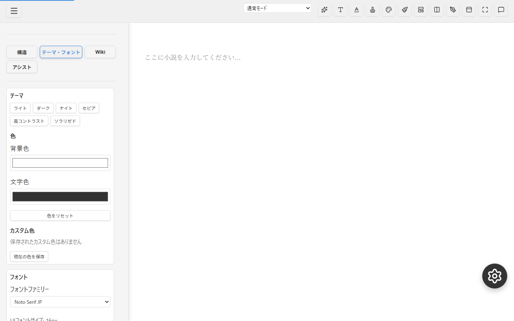
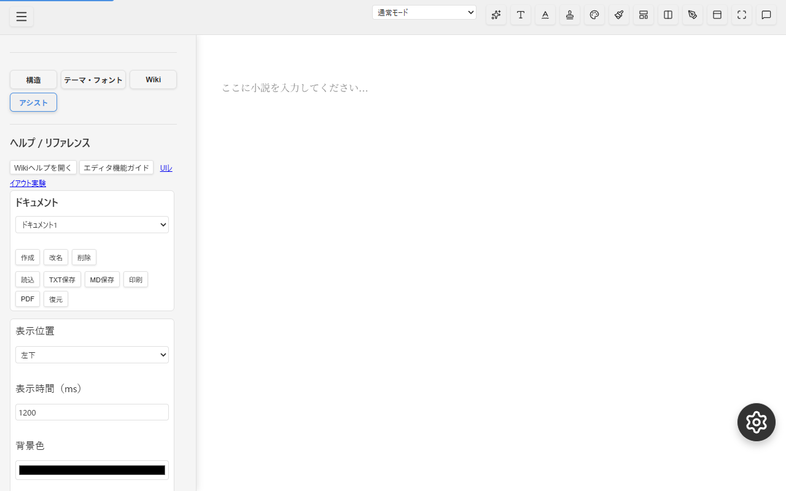
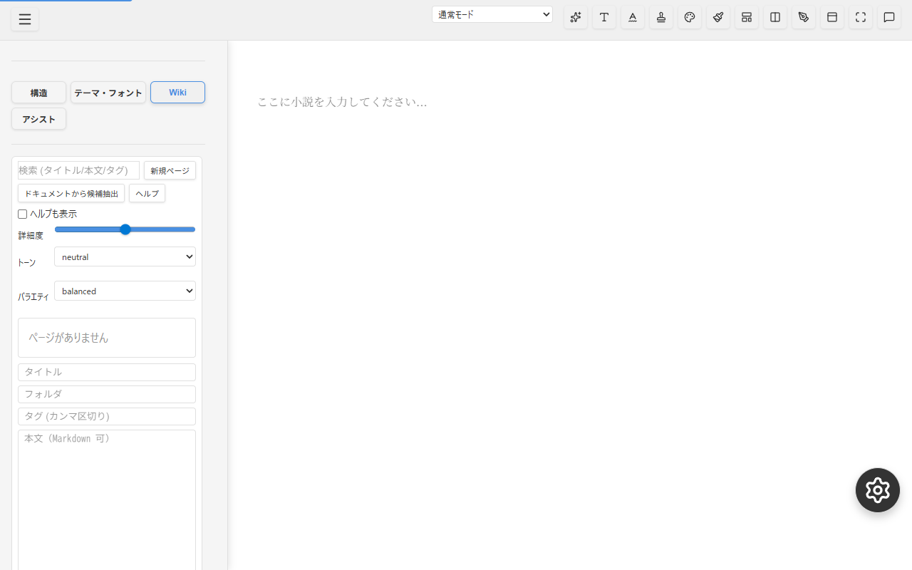

# Project Status Report: Zen Writer

**Date**: 2026-01-30
**Branch**: develop

## 1. Project Updates
- **Git Status**: Up-to-date with `origin/develop`.
- **Recent Activities**:
  - Completed Tasks 036-040, 042, 043.
  - TASK_039 (Embed SDK Audit): Completed Jan 30 - security validation passed.
  - TASK_040 (Docs Audit): Completed Jan 30 - artifacts integrated to HANDOVER.
  - TASK_041 (Smoke Test Audit): Worker Prompt ready, awaiting execution.

## 2. Implementation Status
**Overall Completion**: **98%** (40 of 41 Tasks Completed)

### Implementation Breakdown
| Status | Tasks | Description |
| :--- | :--- | :--- |
| **Completed** | **Task 001 - 040, 042, 043** | Core editor, Gadgets, Sidebar, Phase C/D/E features, WYSIWYG, Mobile/A11y/Formatting, Security Audit, Docs Audit, Visual Verification, Performance Baseline. |
| **In Progress** | **Task 041** | Smoke Test Alignment (Worker Prompt ready). |
| **Backlog** | **Future** | Advanced Tree Pane, Plugin System, DOM Diffing Optimization. |

## 3. Roadmap Tasks
### Short Term (Immediate Focus)
- **TASK_041 (Smoke Test)**: Align `dev-check.js` expectations with current UI. Worker Prompt: `prompts/worker/WORKER_TASK_041_audit_smoke_dev_check.txt`

### Recently Completed
- **TASK_039 (Embed SDK)**: ✅ Security audit passed (Jan 30). See `docs/reports/REPORT_TASK_039_audit_embed_sdk.md`
- **TASK_040 (Docs Audit)**: ✅ Artifacts integrated (Jan 30). See HANDOVER.md updates.

### Medium Term
- **Phase E Polish**: Further refinement of flexible panels and layout (Tasks 29, 30 passed, but follow-up maybe needed).
- **Quality**: Increase E2E coverage for new features (Mobile/A11y).

### Long Term
- **Plugin System**: User-defined gadgets.
- **Typora-like Tree Pane**: Hierarchical document management.
- **Performance**: Live preview DOM diffing (Morphdom integration optimization).

## 4. Project Summary
**Zen Writer** is a web-based writing application focused on a rich, customizable editing experience. It features a robust **Gadget System** (Sidebar tabs, tools), **WYSWYG/Markdown** editing, and **Embedded SDK** capabilities.

### Key Features Implemented:
- **Gadget System**: Modular tools for Structure, Typography, Wiki, Assist.
- **UI Architecture**: Flexible layout with Sidebar, HUD, and Floating Panels.
- **Editing**: Rich Text & Markdown support, Image handling, Text Animation, Focus Mode.
- **Quality**: Smoke tests (`dev-check.js`), E2E Tests (Playwright), ESLint/Prettier standardization.

## 5. Visual Status (2026-01-28)

### Overview

### Editor & Content

### Floating Panels

### Sidebar Gadgets

