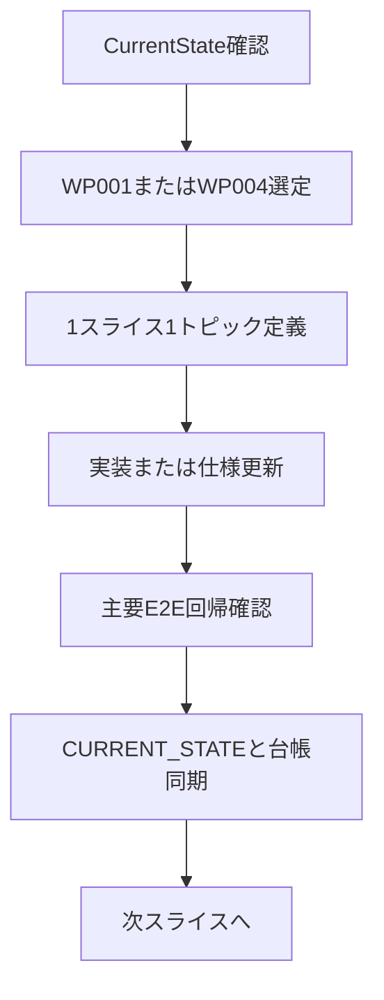

# 推奨開発プラン

最終更新: 2026-04-15（session 90 同期 — WP-001 closeout）

次のプラン策定で迷わないよう、現状分析・時間軸目標・機能別ロードマップを 1 枚に集約する。詳細仕様は下記の正本へ委譲し、本書は「次に何を、どの順序で進めるか」の判断基準として使う。

## 現状分析（As-Is）

- プロダクトは `v0.3.32`、運用の主軸は **`WP-004`（Reader-First WYSIWYG 整合）** 単独。**`WP-001`（UI/UX 摩擦削減）は session 90 で closeout**、**監視モード**へ移行（体感トリガー発火時のみ 1 トピックに昇格）。
- コア機能（章管理・執筆・ナビ・サイドバー保存）は安定化済みで、現フェーズは「大機能追加」より「体験整合・回帰抑止」が優先。
- 主要リスクは、`WP-004 Phase 3` の partial 長期化、deferred（体感依存）課題の再検知遅延、ドキュメント参照先の分散。
- テスト運用は E2E 中心（`npx playwright test --list` ベース）を継続し、変更は 1 トピック単位で閉じる。

## 正本（プラン・仕様・台帳）

| 役割 | ファイル |
|------|----------|
| セッションスナップショット・優先課題 | [`CURRENT_STATE.md`](CURRENT_STATE.md) |
| 推奨スライス順（短期） | [`USER_REQUEST_LEDGER.md`](USER_REQUEST_LEDGER.md) |
| 機能ロードマップ・WP 表 | [`ROADMAP.md`](ROADMAP.md) |
| 機能単位の実装/テスト所在 | [`FEATURE_REGISTRY.md`](FEATURE_REGISTRY.md) |
| 不変条件（運用ガード） | [`INVARIANTS.md`](INVARIANTS.md) |
| 状態モデル・用語 | [`INTERACTION_NOTES.md`](INTERACTION_NOTES.md) |

## 開発目標（To-Be）

### 短期（1〜2 スライス）

1. ~~**WP-001**（UI/UX 摩擦削減）~~ — **session 90 で closeout**。session 72〜88 で既知摩擦 11 件を消化完了、deferred 3 項目は 36 セッション連続で新規再現なし。以降は **監視モード**（体感トリガー発火時のみ 1 トピックに昇格）。
2. **WP-004 Phase 3**（単独主軸）: ~~監査台帳に基づき差分を 1 件ずつ~~（session 76–77: ジャンル style 固定 + reader 系回帰。**自動検証層は session 77 で区切り**。新規差分は手動パック／起票時に 1 トピックで）。次は [`WP004_PHASE3_PARITY_AUDIT.md`](WP004_PHASE3_PARITY_AUDIT.md) の残シナリオ（手動パック）で差分が見つかった場合のみ昇格。
3. **保存導線**: ~~自動保存中心 + 手動導線（コマンド/ショートカット/ヘルプ）の語彙をドキュメント横断で統一~~（**session 80 完了** — `command-palette`・`README`・`gadgets-help`、`spec-writing-mode-unification-prep` に記録）。

### 中期（3〜6 スライス）

- `WP-004 Phase 3` を継続収束し、再生オーバーレイと編集経路の視覚・操作一貫性を固定。
- リッチテキスト強化（[`specs/spec-richtext-enhancement.md`](specs/spec-richtext-enhancement.md)）の Phase 5（表）を、境界確定から段階導入へ接続。
- 回帰ゲートを `command-palette` / `reader-wysiwyg-distinction` / `visual-audit` の主幹 E2E で維持。

### 長期（四半期スパン）

- Priority A〜E を段階的に前進し、執筆体験の完成度と拡張性を両立。
- 保存/同期基盤をクラウド同期要件（認証・競合・復旧）まで定義し、実装可能な状態へ。
- 「モード整合」「保存整合」「UI 密度整合」を運用標準として固定。

## 機能別ロードマップ（優先順）

### 1) 編集体験/UI（WP-001）— **監視モード (session 90 closeout)**

- ステータス: 既知摩擦 11 件を session 72〜88 で消化完了。deferred 3 項目は 36 セッション連続で新規再現なし。
- 再開条件: **ユーザーが体感で新規の摩擦を特定したとき**のみ。その時点で `USER_REQUEST_LEDGER.md` に 1 トピックとして起票。
- 成果指標（過去）: 初回操作の迷い低減、設定変更までの手数削減 — session 72〜88 で連続達成済。

### 2) Reader-First 整合（WP-004）

- 直近: Phase 3 差分を監査台帳ベースで 1 件ずつ修正
- 次点: 再生オーバーレイと編集経路の見た目・操作の差分縮小
- 成果指標: 差分件数減少、関連 E2E の連続安定パス

### 3) リッチテキスト拡張

- 直近: Phase 5（表）着手前の仕様境界を明確化
- 次点: 段階導入 + 回帰防止テスト整備
- 成果指標: 新規表現機能追加時の既存回帰ゼロ

### 4) 保存/同期基盤

- 直近: 保存導線の決定事項を文書間で単一化
- 中長期: クラウド同期の要件定義（認証・競合・復旧）
- 成果指標: データ喪失リスク低減、同期機能への移行容易性

## 次スライス開始条件（Gate）

1. **1 スライス 1 トピック**で対象を固定する（WP-001 と WP-004 を同時に混ぜない）。
2. 実装後に主要回帰を実行する（最低: 変更領域の E2E + 必要な lint）。
3. 完了時に `CURRENT_STATE` と `USER_REQUEST_LEDGER` を同期更新する。
4. 仕様変更を伴う場合は `FEATURE_REGISTRY` / 関連 spec を同スライスで更新する。

## 実行フロー

