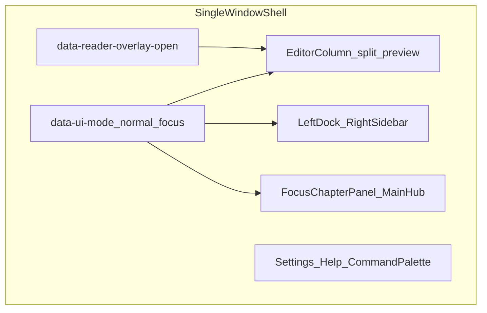

# UI 表面とコントロール台帳

Zen Writer は **単一のブラウザ／Electron ウィンドウ**内で、複数の **状態軸** と **オーバーレイ** を組み合わせて UI を構成する。本書は「いま何種類の画面があるか」の数え方、主要 DOM ブロック、機能の載せ先の方針、重複導線、およびコントロールの接続状況（監査用）をまとめる。

**用語の正本**: UI モードと編集面の定義は [`INTERACTION_NOTES.md`](INTERACTION_NOTES.md) の状態モデルを正とする。旧 3 モード（Reader を `data-ui-mode` とした設計）の歴史は [`specs/spec-mode-architecture.md`](specs/spec-mode-architecture.md) 冒頭の注記に従う。

---

## 1. 数え方（会話でブレない単位）

| 単位 | 個数・説明 |
|------|------------|
| **アプリウィンドウ（OS）** | **1**。Electron も [`electron/main.js`](../electron/main.js) では `mainWindow` が中心。 |
| **`setUIMode` による UI モード** | **2**: `normal`（フルChrome） / `focus`（ミニマル・既定）。 |
| **再生オーバーレイ** | **別軸**（`data-reader-overlay-open`）。旧 Reader **UI モードは廃止**。 |
| **編集面** | **2 系統**: リッチ（WYSIWYG） / Markdown ソース（一般ユーザーは UI から到達しない既定。開発者モード時のみ切替 UI が有効）。 |
| **情報設計上の「主要表面」**（台帳・議論用の固定粒度） | おおよそ **10 前後**: UI モード 2、オーバーレイ 1、編集列＋プレビュー／分割、左ドック、右サイドバー、Focus 到達（章パネル＋メインハブ）、モーダル群（設定・ヘルプ・コマンドパレット）。**実際の見え方の組み合わせは指数的**であり、「画面数最小化」はウィンドウを減らすというより **軸の統合と入口の一本化** が対象になる。 |

---

## 2. 状態軸とシェル（関係図）

---

## 3. 主要 DOM ブロックとデータ属性

| 層 | 識別子・属性 | 役割 | 主な実装参照 |
|----|--------------|------|----------------|
| UI モード | `data-ui-mode="normal"` \| `focus` | フルChrome / ミニマル | [`js/app.js`](../js/app.js) `setUIMode` |
| 再生オーバーレイ | `data-reader-overlay-open="true"` | 閲覧専用の読了確認 | [`js/reader-preview.js`](../js/reader-preview.js) |
| サイドバー開閉 | `#sidebar`、設定 `settings.sidebarOpen` | 右（または左寄せドック時はレイアウト依存）のガジェット列 | [`js/sidebar-manager.js`](../js/sidebar-manager.js) |
| サイドバードック | `data-dock-sidebar` | サイドバーを左／右どちらに寄せるか | [`js/dock-manager.js`](../js/dock-manager.js) |
| 左ドック | `#dock-panel-left`、`data-dock-left-open` | タブ付き左パネル。Normal かつ `leftPanel.visible` のとき開く | 同上 |
| フローティング（ドック外し） | `.dock-floating[data-float-id]` | **別 OS ウィンドウではない**。同一ページ内のドラッグ可能パネル | [`js/dock-manager.js`](../js/dock-manager.js)、[`js/app-ui-events.js`](../js/app-ui-events.js) |
| Focus 章パネル | `#focus-chapter-panel` | Focus 時の左エッジ到達 | [`index.html`](../index.html)、[`js/edge-hover.js`](../js/edge-hover.js) |
| メインハブ | `#main-hub-panel.floating-panel` | Focus 時の上端ホバー／`#show-toolbar` 等から到達 | [`js/main-hub-panel.js`](../js/main-hub-panel.js) |
| メインハブ FAB | `#show-toolbar` | クイックツールパネル開閉（`app-ui-events` で `toggleToolbar`） | [`js/app-ui-events.js`](../js/app-ui-events.js) |
| 互換用サイドバー導線 | `#toggle-sidebar` | 画面外配置。ホバー／ショートカット等から `.click()` で操作 | [`index.html`](../index.html) |
| 設定／ヘルプ | `#settings-modal`、`#help-modal` | モーダルオーバーレイ | [`index.html`](../index.html)、[`js/app.js`](../js/app.js) 等 |
| コマンドパレット | `.floating-panel.command-palette`（JS 生成） | 横断コマンド | [`js/command-palette.js`](../js/command-palette.js) |
| E2E 用 slim | `data-sidebar-slim="true"` | ガジェット chrome 非表示。テスト安定化用 | [`js/sidebar-manager.js`](../js/sidebar-manager.js)、[`e2e/helpers.js`](../e2e/helpers.js) |
| モバイル用 | `#sidebar-overlay` | サイドバー背後のオーバーレイ | [`index.html`](../index.html) |

---

## 4. 機能の載せ先（方針・短い決定文）

以下を **新規機能を置くときの優先順位** として固定する（既存の重複導線は段階的に寄せる）。

1. **横断（どの UI モードでも）**: コマンドパレット（[`FEATURE_REGISTRY.md`](FEATURE_REGISTRY.md) FR-002）および `ZenWriterApp.setUIMode`（FR-001）。
2. **Normal（フルChrome）**: 右サイドバーの **先頭操作帯** と **6 カテゴリのガジェット**。左ドックは **補助ワークスペース**（常時必須ではない）。
3. **Focus（ミニマル）**: **メインハブ**（クイック操作・検索・装飾等）と **章パネル**。サイドバー全カテゴリは **一時オーバーレイ**（設定ボタン経由等）として扱う。
4. **閲覧のみ**: 再生オーバーレイ（`ZWReaderPreview`）。執筆操作はオーバーレイを閉じてから行う。

---

## 5. 同一機能の二重入口（削減時の判断材料）

「画面」が増えたように見える主因の一つ。**どちらを正に残すか** は機能ごとに一行決めればよい（現状は両方維持）。

| 機能 | 入口（例） | メモ |
|------|----------------|------|
| MD プレビュー（横並び） | `#toggle-preview`、`#sidebar-toggle-preview`、メインハブ `data-proxy-click="toggle-preview"`、コマンドパレット | 先頭帯を **正** とし、編集カテゴリ内は折りたたみ補助でもよい。 |
| 分割ビュー | `#toggle-split-view`、`#sidebar-toggle-split`、メインハブ、パレット | 同上。 |
| リッチ編集トグル | `#toggle-wysiwyg`、`#sidebar-toggle-wysiwyg`、メインハブ、パレット | 開発者モード外ではソース編集 UI を出さない既定（[`INTERACTION_NOTES.md`](INTERACTION_NOTES.md)）。 |
| 再生オーバーレイ | `#toggle-reader-preview`、メインハブ、パレット | 「読者**モード**」表記は避ける（オーバーレイが正）。 |
| 設定 | `#toggle-settings`、`#focus-open-settings`、メインハブ、パレット | Focus では章パネルからの導線が重要。 |
| ヘルプ | `#toggle-help-modal`、`#sidebar-toggle-help`、メインハブ | 詳細カテゴリ内の導線は発見性用。 |
| テーマ | `#toggle-theme`、メインハブ | — |
| メインハブ自体 | `#show-toolbar`、ショートカット、エッジホバー | FAB は `element-manager` 経由で接続済み。 |

**メインハブのプロキシ**: `#main-hub-toolbar-proxy` 内の `data-proxy-click` は [`js/main-hub-panel.js`](../js/main-hub-panel.js) の `runHubProxyAction` で上表の `id` にディスパッチされる。`switch` の `default` は **無操作**（未知の `data-proxy-click` を置くと no-op）。

---

## 6. コントロール台帳（初版）

列の意味:

- **状態**: `works`（接続確認済・通常動作想定） / `needs_manual_verify`（表示条件や環境依存） / `registry_mismatch`（台帳・テストと DOM の前提がずれている） / `stub`（仕様上未着手が明示されている近傍）

### 6.1 サイドバー先頭・ドック

| ID 等 | 期待動作 | 実装の目安 | 状態 |
|--------|----------|------------|------|
| `.mode-switch-btn[data-mode]` | `setUIMode('normal'|'focus')` | `app.js`、サイドバー初期化 | works |
| `#fullscreen` | ブラウザ全画面 API | `app-ui-events.js` | needs_manual_verify（ブラウザ権限・Electron 差） |
| `#toggle-preview` | MD プレビュー列の表示切替 | `ZenWriterEditor.togglePreview` | works |
| `#toggle-split-view` | 分割ビュー | `ZenWriterEditor` / `MainHubPanel` | works |
| `#toggle-reader-preview` | 再生オーバーレイ | `ZWReaderPreview.toggle` | works |
| `#toggle-wysiwyg` | リッチ／ソース切替（制限あり） | `editor` 系 | needs_manual_verify（開発者モードゲート） |
| `#toggle-settings` / `#toggle-help-modal` / `#toggle-theme` | 各モーダル・テーマ | `ZenWriterApp` / テーマハンドラ | works |
| `#dock-move-sidebar` / `#dock-toggle-left` | ドック位置・左パネル | `dock-manager.js` | works |
| `#dock-left-close` | 左パネル閉じる | `dock-manager.js` | works |

### 6.2 Focus 章パネル

| ID | 期待動作 | 実装の目安 | 状態 |
|----|----------|------------|------|
| `#focus-exit-to-normal-btn` | Normal へ `setUIMode` | `chapter-list` / `sidebar-manager` 連携 | works |
| `#focus-open-settings` | 設定モーダル | `ZenWriterApp.openSettingsModal` 等 | works |
| `#focus-add-chapter` | 章追加 | `chapter-list.js` | works |

### 6.3 メインハブ（`#main-hub-panel`）

| 領域 | 期待動作 | 実装の目安 | 状態 |
|------|----------|------------|------|
| `#main-hub-toolbar-proxy [data-proxy-click]` | 上記 `toggle-*` 相当 | `main-hub-panel.js` `runHubProxyAction` | works |
| `#global-font-size` / `#global-font-size-number` | 本文フォントサイズ | `element-manager` + `app-ui-events.js` | works |
| `#hud-toggle-visibility` 等 HUD ボタン | HUD 表示・ピン・更新 | `app-ui-events.js` | needs_manual_verify |
| 検索タブ `#search-input` 等 | 検索／置換 | `ZenWriterEditor.toggleSearchPanel` 経由で開く前提 | works（エディタ連携） |
| 装飾／アニメーション `.decor-btn` | 選択範囲へのタグ適用 | `editor-wysiwyg` 系 | needs_manual_verify（フォーカス位置） |

### 6.4 Electron タイトルバー

| ID | 期待動作 | 状態 |
|----|----------|------|
| `#win-minimize` / `#win-maximize` / `#win-close` | IPC 経由でウィンドウ操作 | works（`electron-bridge.js`、`is-electron` 時） |

### 6.5 `WritingTools`（[`js/tools-registry.js`](../js/tools-registry.js)）との整合

| ツール ID | `domId` | `headerIcon` | 問題・メモ | 状態 |
|-----------|---------|----------------|------------|------|
| `editor-layout` | `toggle-preview` | **false** | サイドバー先頭の固定ボタンに対応。`headerIcon: true` にしない（サイドバー外の「ヘッダアイコン」と誤認され、E2E と齟齬になるため）。 | works |
| `hud-control` | `show-toolbar` | false | メインハブ FAB。`app-gadgets-init` の動的ヘッダ生成対象外でもよい。 | works |

**E2E**: [`e2e/tools-registry.spec.js`](../e2e/tools-registry.spec.js) は全エントリの `domId` が DOM に **1 件存在する**ことを検証する。`headerIcon: true` のツールがある場合のみ、可視性・アイコン付与テストが走る。

---

## 7. 画面数を減らすための中長期メモ（ドキュメントレベル）

1. **軸は維持**: UI モード 2 値 ＋ 再生オーバーレイ ＋ 編集面、というモデルを崩さない（読了確認を第 3 の `data-ui-mode` に戻さない）。
2. **入口の統合**: 上記 §5 の表を見て、**片方の導線を deprecate** するときはコマンドパレットとヘルプの一行に移す。
3. **左ドック**: 「常時オン第 2 ペイン」か「オプション作業台」かをプロダクトで一文定義。未使用なら既定 `visible: false` のまま運用でよい（[`js/dock-manager.js`](../js/dock-manager.js) の既定）。
4. **文言**: サイドバー編集カテゴリのヒントは [`index.html`](../index.html) で先頭操作帯／メインハブに整合済み（2026-04-14）。

---

## 8. 監査のやり方（次回セッション用）

1. [`index.html`](../index.html) の `id="toggle-*"` とモーダル／パネルを列挙する。
2. [`js/main-hub-panel.js`](../js/main-hub-panel.js) の `runHubProxyAction` の `case` と `data-proxy-click` を突き合わせる。
3. [`js/tools-registry.js`](../js/tools-registry.js) の `domId` と **`headerIcon` / `sidebarGadget` の可視条件**を突き合わせる。
4. 仕様上の未実装は **本表では一行に留め**、詳細は [`FEATURE_REGISTRY.md`](FEATURE_REGISTRY.md) と該当 `docs/specs/*.md` を正とする。

最終更新: 2026-04-14（レジストリ・文言・E2E 整合）
